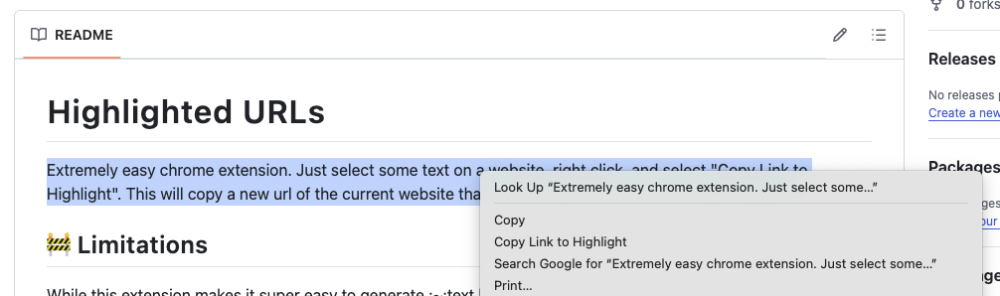

# Highlighted URLs
Extremely easy chrome extension. Just select some text on a website, right click, and select "Copy Link to Highlight". This will copy a new url of the current website that automatically opens it with the text highlighted, like in this [Example link](https://github.com/MrPolymath/highlighted-urls#:~:text=Extremely%20easy%20chrome%20extension.%20Just%20select%20some%20text%20on%20a%20website%2C%20right%20click%2C%20and%20select%20%22Copy%20Link%20to%20Highlight%22.%20This%20will%20copy%20a%20new%20url%20of%20the%20current%20website%20that%20automatically%20opens%20it%20with%20the%20text%20highlighted.).

## 🔧 Installation

1. Download or clone this repository
2. Open Chrome and go to `chrome://extensions/`
3. Enable "Developer mode" in the top right
4. Click "Load unpacked"
5. Select the folder containing the extension files (manifest.json, background.js, etc.)

## 🚧 Limitations
While this extension makes it super easy to generate :~:text highlight links, there are a few important limitations to keep in mind:

### 🔗 Browser Support
- ✅ Fully supported in Chromium-based browsers (e.g., Chrome, Edge, Brave)
- ❌ Not supported in Firefox, Safari, or some mobile browsers

### 🧠 Exact Text Match Required
- The selected text must appear exactly on the page as-is
- Minor differences (extra spaces, newlines, punctuation changes) can break the highlight
- Dynamic content loaded after page load (e.g. via JavaScript) may not be matched reliably

### 🔍 First Match Only
If the selected text appears multiple times on the page, the browser will highlight only the first occurrence.

### 📏 Long Selections Are Trimmed
To keep links reliable, the extension uses only the first and last few words of your selection.

This mimics how Chrome generates shareable text fragments, but can occasionally fail if the resulting chunk is not unique enough.

### ❌ No Error Feedback
If the browser fails to find or highlight the text, the link will just open the page with no indication that something went wrong.

### 🪄 No Custom Styling
The browser controls the appearance of the highlight (usually yellow) and it cannot be customized.